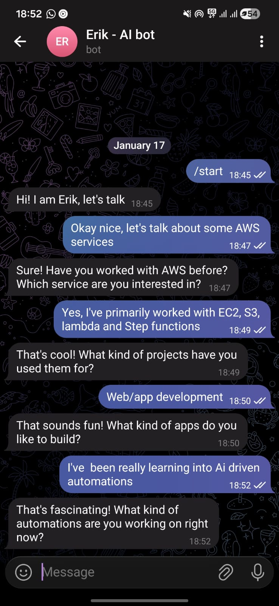
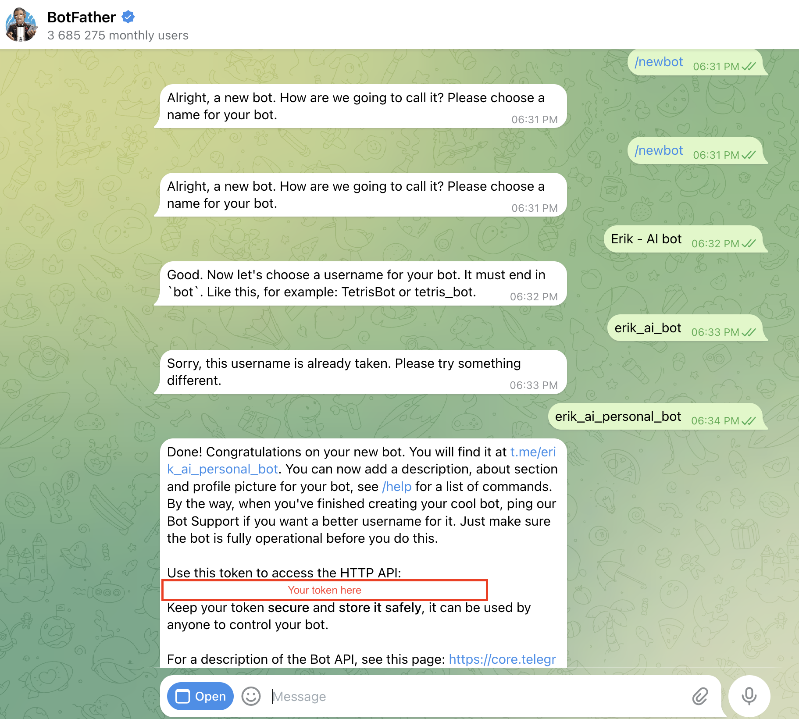

# Serverless Telegram AI Bot: Event-Driven Architecture on AWS with CDK

A high-performance, scalable, and cost-effective **Telegram AI Bot** built with **AWS CDK** and **TypeScript**. This project uses an **Event-Driven Architecture (EDA)** to handle high traffic and long-running workflows without hitting Telegram webhook timeouts.

[](https://aws.amazon.com/)
[](https://nodejs.org/en)
[](https://www.typescriptlang.org/)
[](https://telegram.org/)

---

## 🔗 Live Demo
You can try the bot directly on Telegram:

👉 [Erik AI bot](https://t.me/erik_ai_example_bot)



---

## 🏗️ Architecture Overview

Unlike traditional bots that process all logic inside the webhook request-response cycle, this bot follows an **asynchronous and decoupled flow**:

1. **Telegram Webhook** sends a `POST` request to **Amazon API Gateway**.
2. **Webhook Controller (Lambda)**

   * Validates the incoming request
   * Stores the message in **DynamoDB**
   * Immediately returns `200 OK` to Telegram
3. **DynamoDB Streams** trigger the message stream processor.
4. **Message Stream Processor Lambda** prepares context and invokes the AI Lambda.
5. **AI Lambda** retrieves conversation history, calls the Bedrock model, and generates a response.
6. **Telegram API** is called asynchronously to send the message back to the user.

This design guarantees low latency for Telegram while allowing complex processing in the background.

---

## ⚡ Key Features

* **AWS Services**: Bedrock, Lambda, HTTP API, DynamoDB, Secrets Manager, IAM Role
* **High Performance**: Node.js 22 running on Graviton2 (ARM_64).
* **No Webhook Timeouts**: Ingestion is fully decoupled from processing.
* **Event-Driven**: DynamoDB Streams orchestrate the workflow.
* **Infrastructure as Code**: Fully managed with AWS CDK.
* **Production Ready**:

  * CloudWatch Log Groups
  * Secrets stored securely in AWS Secrets Manager
  * Optimized Lambda bundling (ESM + Minified)

---

## 🚀 Getting Started

### Prerequisites

* AWS Account with credentials configured locally
* Node.js **22.x**
* AWS CDK installed globally

  ```bash
  npm install -g aws-cdk
  ```

---

### Installation

```bash
git clone https://github.com/andresaraque/telegram-bot.git
cd telegram-bot
npm install
```

---

## 🤖 Creating the Telegram Bot

1. Open Telegram and search for **@BotFather** or open chat 👉 [@BotFather](https://t.me/botfather).
2. Start the conversation and run:

   ```text
   /newbot
   ```
3. Choose:

   * A **display name** (e.g. `Erik AI Bot`)
   * A **username** that must end with `bot` (e.g. `erik_ai_example_bot`)
4. BotFather will return a message containing a **token to access the HTTP API**.

⚠️ **Important**: Copy this token and keep it safe. You will need it after deploying the infrastructure.



---

## 🔐 Configuring the Telegram Bot Token in AWS

This project stores the Telegram Bot token securely in **AWS Secrets Manager**.

### Steps

1. ☁️ Deploying the Infrastructure:

   ```bash
   npx cdk deploy
   ```

2. After deployment, go to **AWS Secrets Manager** in the AWS Console.

3. Locate the secret:

   ```text
   telegram-ai-example/webhook-connection-token
   ```

4. Click **Retrieve secret value**.

5. Replace the default placeholder value:

   ```text
   telegram-token-change-me-after-deploy
   ```

   with the real **BotFather token** you copied earlier.

6. Save the changes.

This allows the Lambdas to authenticate securely with the Telegram HTTP API without hardcoding secrets.

---

After deployment, CDK will print the stack outputs. You should see something similar to:

```text
TelegramBotStack.WebhookUrlApiGatewayPRO = https://{API_ID}.execute-api.{REGION}.amazonaws.com/pro/webhook
```

This URL is your **Telegram Webhook endpoint**.

---

## 🤖 Registering the Webhook in Telegram

Once the stack is deployed, register the webhook using the Telegram Bot API.

Replace the values below:

* `<BOT_TOKEN>` → Your Telegram bot token
* `<WEBHOOK_URL>` → The URL from the CDK output (our HTTP API of AWS)

```bash
curl -X POST \
  https://api.telegram.org/bot<BOT_TOKEN>/setWebhook \
  -d "url=<WEBHOOK_URL>"
```

Expected response:

```json
{
  "ok": true,
  "result": true,
  "description": "Webhook was set"
}
```

You can verify the webhook configuration with:

```bash
curl https://api.telegram.org/bot<BOT_TOKEN>/getWebhookInfo
```

---

## 🛠️ Useful CDK Commands

```bash
npm run build     # Compile TypeScript to JavaScript
npm run watch     # Watch for changes and recompile
npm run test      # Run Jest unit tests
npx cdk deploy    # Deploy the stack
npx cdk diff      # Compare deployed stack with local changes
npx cdk synth     # Generate CloudFormation template
```

---

## 📌 Notes

* The webhook endpoint must be **public and HTTPS**.
* The webhook Lambda **must always return `200 OK` quickly** to avoid message retries from Telegram.
* All heavy processing is handled asynchronously via DynamoDB Streams.

---
